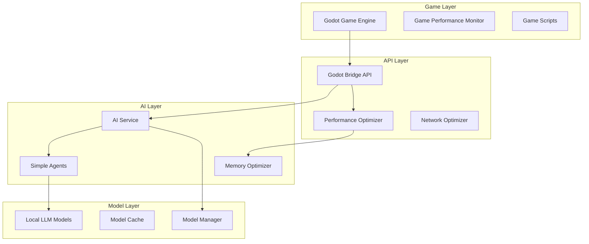

# Architecture Overview

Comprehensive guide to the Generative Agents with Local LLM and Godot architecture.

## 🏗️ System Overview

The system is designed as a modular, performance-optimized platform for creating AI-powered game characters that run entirely locally.



## 🔧 Core Components

### 1. AI Service (`ai_service/`)

**Purpose:** Central AI processing hub with local LLM management

**Key Files:**
- `ai_service.py` - Main service with FastAPI endpoints
- `config_enhanced.py` - Advanced configuration management
- `error_handling.py` - Robust error recovery
- `monitoring.py` - Performance tracking
- `local_llm_adapter.py` - Model interface abstraction

**Features:**
- Local LLM processing (GPT4All/Qwen)
- Automatic model management
- Health monitoring
- Fallback mechanisms
- Performance optimization

**API Endpoints:**
```python
POST /ai/generate          # Generate AI response
POST /ai/chat              # Character dialogue
POST /ai/decide            # Decision making
GET  /ai/health            # Service status
GET  /ai/metrics           # Performance data
```

### 2. Simple Agents (`agents/`)

**Purpose:** Lightweight AI character system

**Key Files:**
- `simple_agents.py` - Agent implementation with memory, emotions, decisions

**Agent Architecture:**
```python
class SimpleAgent:
    # Core Identity
    name: str
    personality: str
    background: str
    
    # State Management
    emotional_state: EmotionalState
    activity: ActivityType
    location: Location
    
    # Cognitive Systems
    memory: SimpleMemorySystem
    relationships: Dict[str, float]
    
    # Interaction Methods
    def respond_to(speaker, message) -> str
    def decide_action(options) -> Tuple[str, str]
    def think(topic) -> str
    def perceive(observation)
```

**Memory System:**
- Short-term memory (recent events)
- Long-term memory (important experiences)
- Contextual retrieval
- Automatic importance scoring

**Emotion System:**
- Dynamic emotional states
- Event-driven emotion updates
- Relationship tracking
- Behavioral influence

### 3. Performance Optimization Suite

#### Performance Optimizer (`performance_optimizer.py`)

**Features:**
- AI response caching (Redis/Memory)
- Model preloading and management
- Real-time performance monitoring
- Automatic optimization adjustments

**Caching Strategy:**
```python
# Multi-layer caching
L1: Memory Cache (1000 entries, 1-hour TTL)
L2: Redis Cache (10000 entries, 24-hour TTL)
L3: Disk Cache (Persistent, 7-day TTL)
```

#### Memory Optimizer (`memory_optimizer.py`)

**Features:**
- Object pool management
- Weak reference tracking
- Intelligent garbage collection
- Memory pressure monitoring

**Memory Management:**
```python
# Memory thresholds
Warning:  75% system memory
Critical: 85% system memory
Cleanup:  80% system memory

# Optimization strategies
- Object pooling for frequent allocations
- Weak references for temporary objects
- Proactive garbage collection
- Memory pressure relief
```

#### Network Optimizer (`network_optimizer.py`)

**Features:**
- Connection pooling
- Request batching
- Response caching
- Async request handling

### 4. Godot Integration

#### Game Performance Monitor (`godot_performance_config.gd`)

**Features:**
- Real-time FPS monitoring
- Dynamic quality adjustment
- LOD (Level of Detail) management
- Memory optimization

**Quality Levels:**
```gdscript
Low:    2GB RAM, basic features, 20+ FPS
Medium: 4GB RAM, standard features, 30+ FPS  
High:   6GB RAM, advanced features, 45+ FPS
Ultra:  8GB+ RAM, all features, 60+ FPS
```

#### AI Manager Integration

**Communication Flow:**
```
Godot Game → HTTP Request → Godot Bridge API → AI Service → Simple Agents → Local LLM
```

**Data Format:**
```json
{
  "character_name": "Alice",
  "action": "dialogue",
  "context": {
    "location": "town_square",
    "other_characters": ["Bob", "Charlie"],
    "recent_events": ["player_approached"]
  },
  "message": "Hello there!"
}
```

## 🚀 Performance Architecture

### Multi-Layer Optimization

```
Application Layer:
├── Demo Performance Suite (Orchestration)
├── Performance Optimizer (AI/Cache)
├── Memory Optimizer (RAM/GC)
├── Network Optimizer (HTTP/Batch)
└── Godot Performance Config (Rendering)
```

### Performance Targets

| Component | Target | Monitoring |
|-----------|--------|------------|
| AI Response | < 2.0s | Real-time tracking |
| Memory Usage | < 4GB | Continuous monitoring |
| Game FPS | > 30 | Frame-by-frame |
| Cache Hit Rate | > 30% | Request-level |
| System CPU | < 80% | Process monitoring |

### Optimization Strategies

**Proactive Optimization:**
- Model preloading during idle time
- Predictive caching of common responses
- Memory pool pre-allocation
- Connection keep-alive

**Reactive Optimization:**
- Performance threshold monitoring
- Automatic quality degradation
- Emergency memory cleanup
- Fallback response systems

## 🔄 Data Flow

### Agent Interaction Flow

```
1. User Input (Godot/API)
   ↓
2. Context Gathering
   ↓
3. Memory Retrieval
   ↓
4. AI Processing (Cached/Fresh)
   ↓
5. Response Generation
   ↓
6. Memory Storage
   ↓
7. Emotional Update
   ↓
8. Response Delivery
```

### Performance Monitoring Flow

```
1. Metric Collection (All Components)
   ↓
2. Performance Analysis
   ↓
3. Threshold Checking
   ↓
4. Optimization Decision
   ↓
5. Strategy Application
   ↓
6. Effect Monitoring
   ↓
7. Feedback Loop
```

## 🏛️ Design Principles

### 1. Modularity
- **Loose Coupling:** Components communicate via well-defined interfaces
- **Single Responsibility:** Each module has a focused purpose
- **Pluggable Architecture:** Easy to swap implementations

### 2. Performance First
- **Lazy Loading:** Load resources only when needed
- **Aggressive Caching:** Cache at multiple levels
- **Resource Pooling:** Reuse expensive objects
- **Fallback Systems:** Graceful degradation under load

### 3. Local-First
- **No Internet Required:** Fully functional offline
- **Privacy Focused:** No data leaves the system
- **Low Latency:** Direct hardware access
- **Reliable:** No external dependencies

### 4. Developer Experience
- **Simple APIs:** Easy to understand and use
- **Rich Documentation:** Comprehensive guides
- **Debugging Tools:** Built-in diagnostics
- **Configuration:** Flexible and intuitive

## 🔌 Extension Points

### Adding New Agent Types

```python
class CustomAgent(SimpleAgent):
    def __init__(self, special_ability: str):
        super().__init__(name="Custom", personality="Special")
        self.special_ability = special_ability
    
    def use_special_ability(self) -> str:
        # Custom logic here
        return self.special_ability
```

### Custom Performance Optimizers

```python
class CustomOptimizer:
    def optimize(self, metrics: PerformanceMetrics):
        # Custom optimization logic
        if metrics.custom_metric > threshold:
            self.apply_custom_optimization()
```

### Godot Script Extensions

```gdscript
# Custom character controller
extends CharacterBody2D

@onready var ai_optimizer = preload("godot_performance_config.gd").new()

func _ready():
    ai_optimizer.setup_for_character(self)
```

## 🌐 API Architecture

### RESTful Design

```
GET    /ai/health           # Service health status
POST   /ai/generate         # Generate AI response
POST   /ai/chat             # Character dialogue
POST   /ai/decide           # Decision making
GET    /ai/metrics          # Performance metrics
POST   /ai/agents           # Create agent
GET    /ai/agents/{id}      # Get agent state
PUT    /ai/agents/{id}      # Update agent
DELETE /ai/agents/{id}      # Remove agent
```

### WebSocket Support (Future)

```
ws://localhost:8080/ai/stream  # Real-time updates
```

## 🔐 Security Considerations

### Local-Only Processing
- No external API calls
- No data transmission over internet
- Local model storage
- Private conversation history

### Resource Protection
- Memory usage limits
- CPU usage monitoring
- Disk space management
- Process isolation

### Error Handling
- Graceful fallbacks
- Resource cleanup
- Safe shutdowns
- Recovery mechanisms

## 📊 Monitoring & Observability

### Metrics Collection

**System Metrics:**
- CPU usage per component
- Memory allocation and cleanup
- Disk I/O for model loading
- Network activity (local only)

**Application Metrics:**
- AI response times
- Cache hit/miss rates
- Agent interaction frequency
- Error rates and types

**Game Metrics:**
- Frame rates and consistency
- Rendering performance
- Input responsiveness
- Asset loading times

### Logging Strategy

```
INFO:  Normal operations
WARN:  Performance degradation
ERROR: Recoverable failures
FATAL: System-level failures
DEBUG: Development diagnostics
```

### Performance Reports

**Real-time Dashboard:**
- Live performance metrics
- Resource utilization
- Optimization status
- Alert notifications

**Historical Analysis:**
- Performance trends
- Optimization effectiveness
- Resource usage patterns
- Error frequency analysis

## 🚀 Deployment Architecture

### Development Mode
```
Local Machine:
├── Python Environment (.venv)
├── AI Service (localhost:8080)
├── Godot Editor
├── Performance Monitoring
└── Development Tools
```

### Production Mode
```
Game Distribution:
├── Packaged Python Runtime
├── Embedded AI Models
├── Godot Game Executable
├── Optimized Configuration
└── Minimal Dependencies
```

### Docker Deployment
```yaml
# Multi-container setup
services:
  ai-service:    # AI processing
  game-server:   # Game logic
  monitor:       # Performance monitoring
```

## 🔮 Future Architecture Considerations

### Scalability
- Distributed agent processing
- Model sharing across instances
- Cloud-hybrid deployment options
- Multi-player coordination

### Advanced AI
- Fine-tuned character models
- Larger context windows
- Multi-modal inputs (voice, vision)
- Advanced reasoning capabilities

### Enhanced Integration
- Unity engine support
- Unreal Engine integration
- Web-based deployment
- Mobile optimization

---

This architecture provides a solid foundation for building sophisticated AI-powered games while maintaining excellent performance and developer experience. The modular design allows for easy customization and extension as needs evolve.