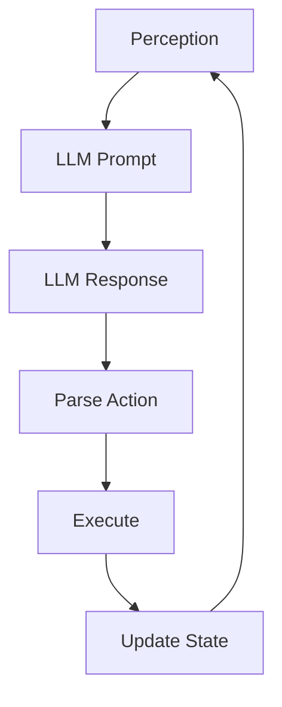

# Action Flow Diagram

## Flow Details

### Step 1: PERCEPTION
**Time**: 2025-08-21T15:22:58.125522

**Agent**: IntegratedTestAgent
**Input**: Bar is busy, multiple customers waiting, need to prioritize

---

### Step 2: LLM_PROMPT
**Time**: 2025-08-21T15:22:58.125536

---

### Step 3: LLM_RESPONSE
**Time**: 2025-08-21T15:22:58.125544

**Response**: I should quickly serve the waiting customers in order

---

### Step 4: ACTION_PARSING
**Time**: 2025-08-21T15:22:58.125589

---

### Step 5: EXECUTION
**Time**: 2025-08-21T15:22:58.125598

---

